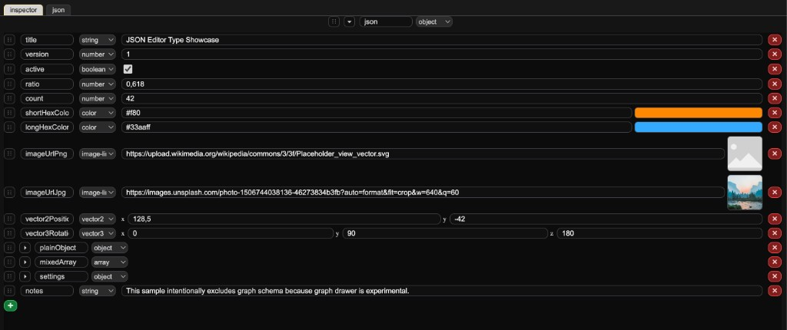

# JSON Editor

**[Live demo link](https://yan-vi.github.io/JSON_Editor/)**

Visual JSON editor with inspector-style property editing and raw JSON tab. The drawer UI is inspired by data inspectors in game engines.

## Editor

**Inspector tab** – Form-style editors for each field. Drag handles reorder array/object entries. Type selector changes the drawer per key.

**JSON tab** – Raw text editing with line numbers. Tab inserts 2 spaces. Format button pretty-prints and applies. Invalid JSON shows an error with line highlight; edits are not applied until valid. Input debounced (~220 ms) before parsing into the tree.

**Tab switching** – Switching to JSON syncs current state into the textarea. Switching to Inspector shows the live state. Both tabs operate on the same in-memory tree.

**Shortcuts**: Ctrl/Cmd+Z (undo), Ctrl/Cmd+Shift+Z or Ctrl+Y (redo)

**History**: JSON and drawer type hints together, up to 400 entries. Redo stack clears on new edits

## Tech

- Vite 7
- TypeScript
- Single-file build (`docs/index.html`) for GitHub Pages

## Commands

| Command | Description |
|---------|-------------|
| `npm run dev` | Start dev server |
| `npm run build` | Build to `docs/` |
| `npm run preview` | Preview production build |
| `npm run typecheck` | Run TypeScript check |

GitHub Actions (`.github/workflows/build.yml`) runs `npm ci` and `npm run build` on push/PR, and deploys to GitHub Pages on push to `main` or `master`. Set Pages source to GitHub Actions in repo settings.

## Drawers

- **string** – Text input
- **number** – Numeric input
- **boolean** – Checkbox
- **color** – Hex color picker
- **image-link** – URL input with image preview
- **vector2** – x, y fields
- **vector3** – x, y, z fields
- **object** – Collapsible key-value list
- **array** – Ordered list with add/delete

Drawers auto-detect from value; type can be changed via the selector.

## Default Data

`resources/test.json` is loaded on startup. Add this file to the repo for CI builds.
